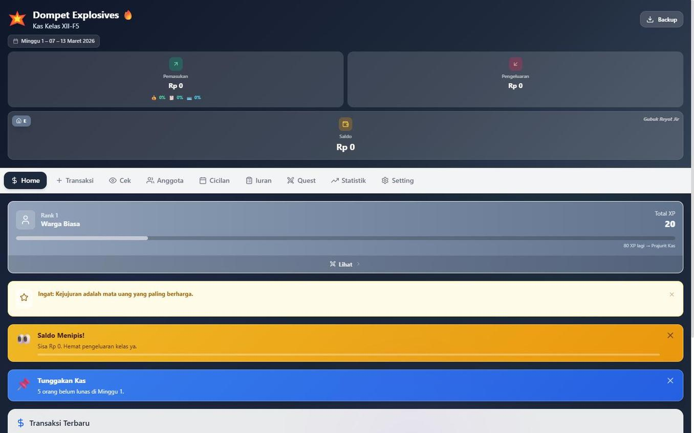
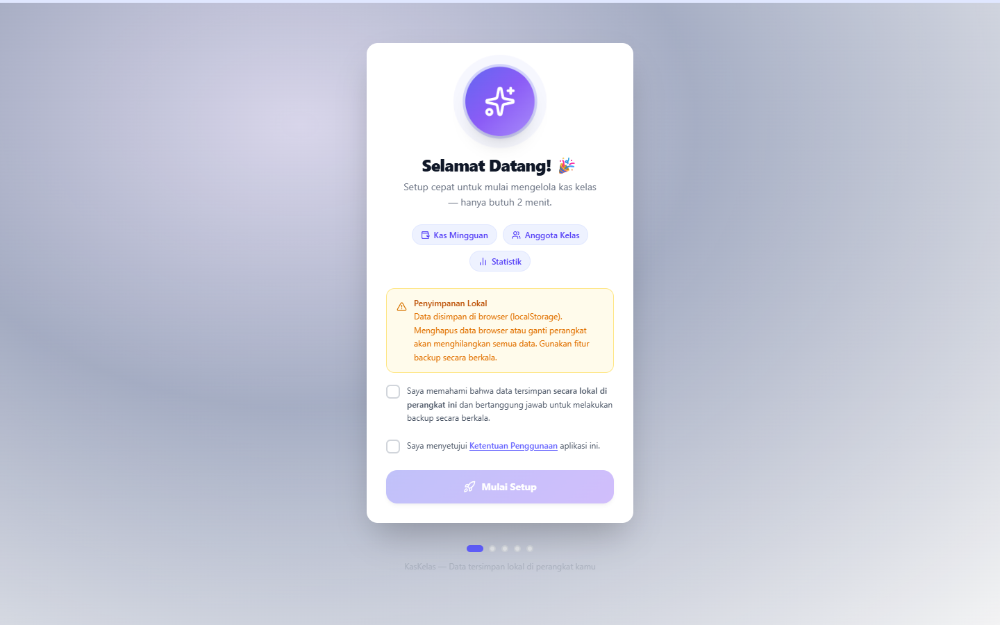

<p align="center">
  
</p>

<h1 align="center">💣 Dompet Explosives</h1>

<p align="center">
  <strong>Aplikasi Kas Kelas Modern — Offline, Gratis, & Seru</strong>
</p>

<p align="center">
  <em>Buat bendahara kelas yang capek ngitung manual. Setup 2 menit, langsung jalan.</em>
</p>

<br />

<p align="center">
  <a href="https://kaskelasxiif5.vercel.app">
    
  </a>
</p>

<p align="center">
  
  
  
  
  
  
</p>

<br />

<p align="center">
  
</p>

---

## 📑 Table of Contents

- [Apa Sih Ini?](#-apa-sih-ini)
- [Preview](#-preview)
- [Features](#-features)
- [Tech Stack](#-tech-stack)
- [Quick Start](#-quick-start)
- [Project Structure](#-project-structure)
- [Data & Privacy](#-data--privacy)
- [Roadmap](#-roadmap)
- [Contributing](#-contributing)
- [License](#-license)

---

## 🤔 Apa Sih Ini?

**Dompet Explosives** adalah web app buat bendahara kelas yang pengen ngurus kas tanpa ribet. Semua serba otomatis — dari tracking kas mingguan, iuran, cicilan, sampe generate laporan PDF yang tinggal print.

Ada sistem **RPG** juga 🎮 — setiap aksi dapet XP, naik level, buka achievement. Biar ngurus duit kelas gak boring.

> **💡 Key Point:** Semua data 100% disimpan di browser kamu (localStorage). Gak ada server, gak ada database, gak ada yang bisa intip. Privacy first, ribet last.

---

## 📸 Preview

<table>
  <tr>
    <td align="center" width="50%">
      
      <br />
      <strong>Dashboard</strong>
      <br />
      <sub>Ringkasan saldo, pemasukan, pengeluaran, rank RPG</sub>
    </td>
    <td align="center" width="50%">
      
      <br />
      <strong>First Setup Wizard</strong>
      <br />
      <sub>Setup kelas cuma 2 menit, guided step-by-step</sub>
    </td>
  </tr>
</table>

> 🔗 **Coba langsung:** [kaskelasxiif5.vercel.app](https://kaskelasxiif5.vercel.app)

---

## ✨ Features

### 💰 Finance Core

| Fitur | Deskripsi |
|-------|-----------|
| **Dashboard** | Ringkasan saldo real-time, chart pemasukan vs pengeluaran, daily tips |
| **Kas Mingguan** | Track pembayaran per minggu, toggle lunas/belum, progress bar |
| **Iuran** | Custom iuran + deadline, pantau siapa yang udah bayar |
| **Cicilan** | Bayar nyicil, auto-mark lunas kalau udah cukup |
| **Transaksi** | Log semua pemasukan & pengeluaran dengan kategori, search, filter |
| **Per Anggota** | Detail lengkap per siswa — payment history, progress bar, quick cicil |

### 📊 Reporting & Export

| Fitur | Deskripsi |
|-------|-----------|
| **PDF Export** | Laporan resmi lengkap, tinggal print buat wali kelas |
| **CSV Export** | Export ke spreadsheet buat diolah lebih lanjut |
| **Copy Report** | Satu klik → langsung paste ke grup WhatsApp |

### 🎮 Gamification (RPG System)

| Fitur | Deskripsi |
|-------|-----------|
| **XP & Level** | Setiap aksi dapet XP — backup? XP. Export PDF? XP. |
| **Daily & Weekly Quest** | Challenge harian dan mingguan biar makin rajin |
| **10+ Achievement** | Badge kayak "Bendahara Teladan", "Sigma Grindset", "Debt Slayer" |
| **Login Streak** | Streak harian — jangan sampe putus! |

### 🔒 Security & Utils

| Fitur | Deskripsi |
|-------|-----------|
| **PIN Lock** | Kunci app pake PIN 4-6 digit |
| **Backup & Restore** | Export/import data JSON kapan aja |
| **Auto-Save** | Data otomatis kesimpan setiap ada perubahan |
| **Sound & Haptics** | Efek suara satisfying buat setiap aksi |

---

## 🛠 Tech Stack

| Layer | Technology | Keterangan |
|-------|-----------|------------|
| ⚛️ Frontend | React 19 | UI library utama |
| ⚡ Build Tool | Vite 8 (beta) | Lightning-fast HMR |
| 🎨 Styling | Tailwind CSS 4 | Utility-first CSS |
| 🎯 Icons | Lucide | Via CDN, 1500+ icons |
| 📈 Charts | Chart.js | Grafik pemasukan/pengeluaran |
| 📄 PDF | jsPDF + AutoTable | Generate laporan resmi |
| 🎊 Animation | CSS Keyframes + Canvas Confetti | Milestone celebration |
| 💾 Storage | localStorage | Offline-first, no server |

---

## 🚀 Quick Start

### Prerequisites

- **Node.js** 18 atau lebih baru — [Download Node.js](https://nodejs.org/)
- **npm** 9+ (udah include sama Node.js)
- **Git** — [Download Git](https://git-scm.com/)

### Installation

```bash
# 1. Clone repo
git clone https://github.com/Riz6ix/Dompet-Explosives.git

# 2. Masuk folder project
cd Dompet-Explosives

# 3. Install semua dependencies
npm install

# 4. Jalanin dev server
npm run dev
```

Buka **http://localhost:5173** di browser → ikutin setup wizard → selesai. ✅

### Other Commands

```bash
npm run build      # Build buat production
npm run preview    # Preview production build lokal
npm run lint       # Cek linting errors
```

> **⚠️ Catatan:** Project ini pake **Vite 8 beta** dan **Tailwind 4**. Pastiin Node.js kamu minimal versi 18.

---

## 📁 Project Structure

```
Dompet-Explosives/
├── public/               # Static assets (favicon, dll)
├── docs/                 # Screenshots & documentation assets
├── src/
│   ├── components/       # Shared UI components
│   │   ├── FirstSetup.jsx    # Setup wizard
│   │   ├── Toast.jsx         # Notification toast
│   │   └── LucideIcon.jsx    # Icon wrapper
│   ├── constants/        # Config & member defaults
│   ├── features/         # Tab-based feature modules
│   │   ├── cek-bayar/        # 📋 Cek status pembayaran
│   │   ├── cicilan/          # 💳 Manage cicilan
│   │   ├── dashboard/        # 🏠 Main dashboard
│   │   ├── iuran/            # 📝 Iuran management
│   │   ├── pengaturan/       # ⚙️ Settings & members
│   │   ├── per-anggota/      # 👤 Detail per siswa
│   │   ├── quest/            # 🎮 RPG quest system
│   │   ├── statistik/        # 📊 Charts & analytics
│   │   └── transaksi/        # 💰 Transaction log
│   ├── hooks/            # Custom React hooks
│   ├── styles/           # CSS (theme, animations)
│   ├── utils/            # Helper functions
│   └── App.jsx           # Main app entry
├── index.html            # HTML entry + SEO meta tags
├── vite.config.js        # Vite configuration
├── package.json          # Dependencies & scripts
├── CONTRIBUTING.md       # Panduan kontribusi
└── LICENSE               # MIT License
```

---

## 🔐 Data & Privacy

| | Detail |
|---|---|
| 📍 **Storage** | 100% client-side — semua data cuma ada di browser kamu |
| 🚫 **No Server** | Nothing goes to any server. Zero tracking. Zero analytics. |
| 🔑 **PIN Lock** | Optional lock screen buat jaga dari tangan jahil |
| 💾 **Backup** | Export/import JSON kapan aja — sering-sering backup ya! |

> **⚠️ Penting:** Kalau kamu clear browser data / ganti device tanpa backup, data hilang. Selalu backup sebelum clear cache!

---

## 🗺 Roadmap

Rencana ke depan (belum tentu semua bakal kejadian, tapi ini wishlist-nya):

- [ ] 🏫 **Multi-class support** — Manage beberapa kelas sekaligus
- [ ] ☁️ **Cloud sync** — Optional, buat yang mau kolaborasi real-time
- [ ] 📱 **PWA upgrade** — Biar makin smooth di mobile
- [ ] 🔐 **Data encryption** — Extra layer keamanan
- [ ] 📊 **More analytics** — Grafik trend bulanan, prediksi saldo

---

## 🤝 Contributing

Mau contribute? Boleh banget — dari report bug, fix typo, sampe nambah fitur baru.

Cek panduan lengkapnya di **[CONTRIBUTING.md](CONTRIBUTING.md)**.

```bash
# Quick start buat contributor
git clone https://github.com/USERNAME/Dompet-Explosives.git
cd Dompet-Explosives
npm install
npm run dev
```

---

## 📄 License

[MIT License](LICENSE) — bebas dipake, dimodif, di-fork. Go wild.

---

## 👤 Author

<table>
  <tr>
    <td align="center">
      <a href="https://github.com/Riz6ix">
        
        <br />
        <strong>Iky Setiawan</strong>
      </a>
      <br />
      <sub>@Riz6ix</sub>
    </td>
  </tr>
</table>

---

<p align="center">
  <sub>Built with ☕, CSS pain, dan banyak debugging.</sub>
  <br />
  <sub>Kalau berguna, kasih ⭐ dong. Gratis kok.</sub>
</p>

<!-- SEO Keywords: dompet explosives, kas kelas, aplikasi kas kelas gratis, bendahara kelas, manajemen keuangan kelas, class finance app, react offline-first, gamified finance, iuran kelas, cicilan kelas -->
